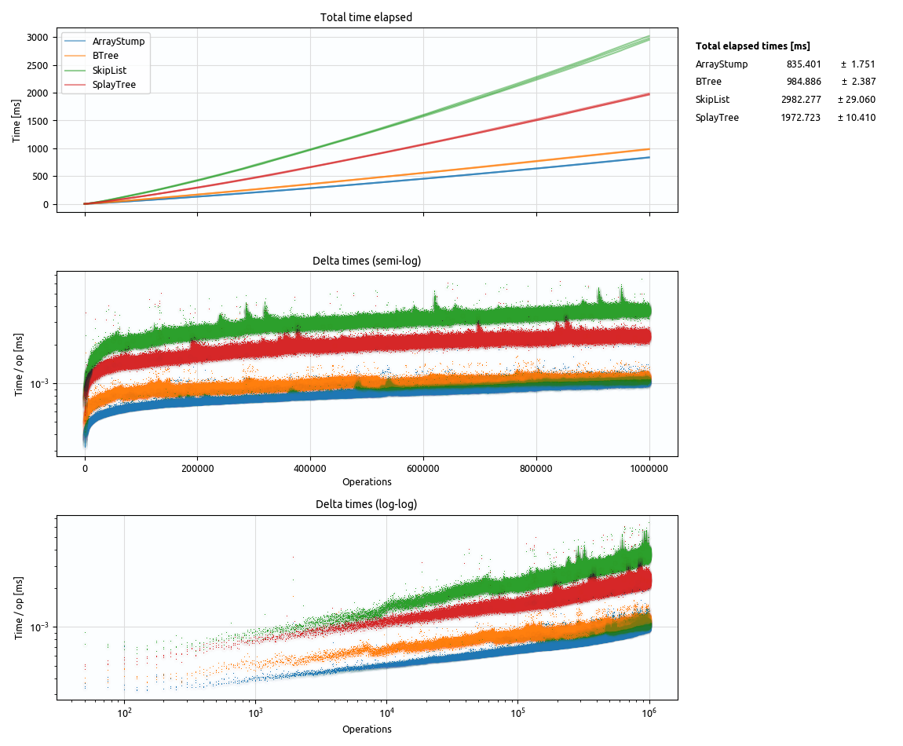
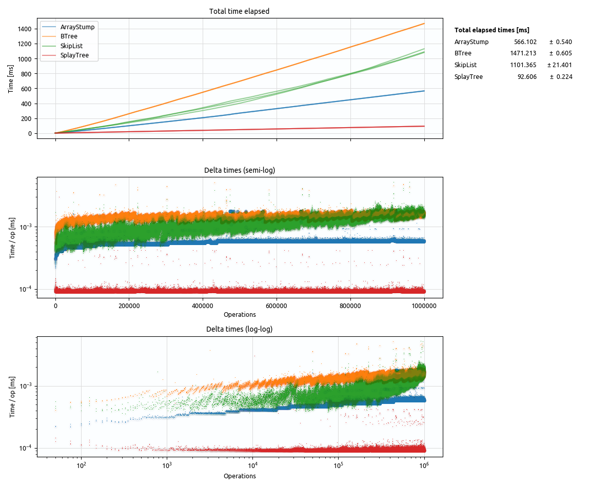
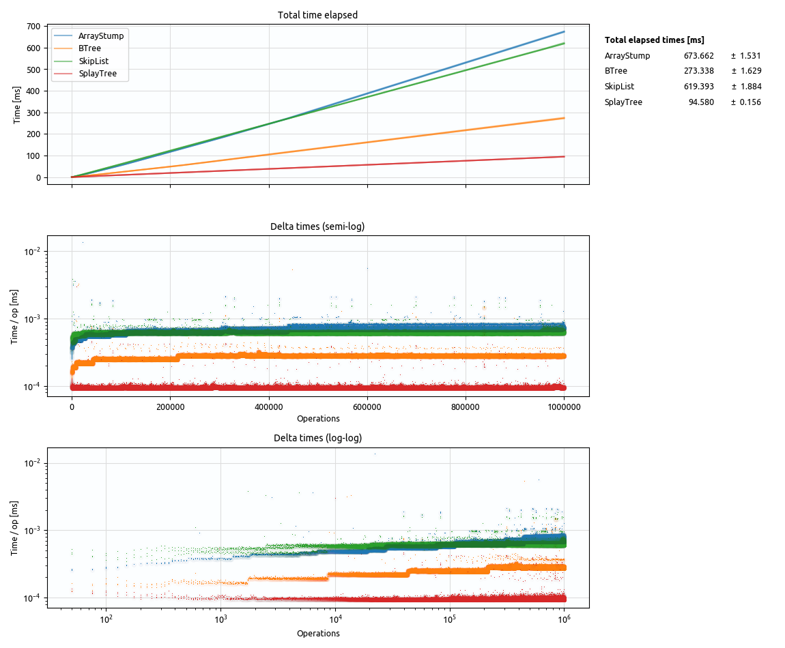
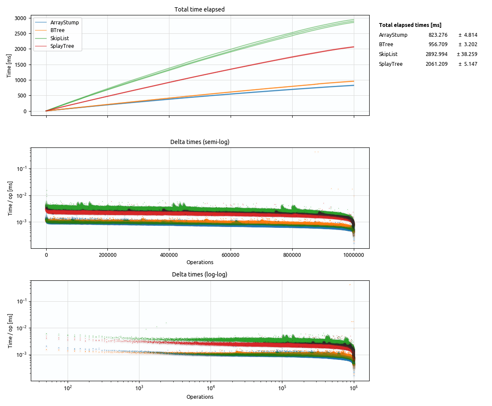
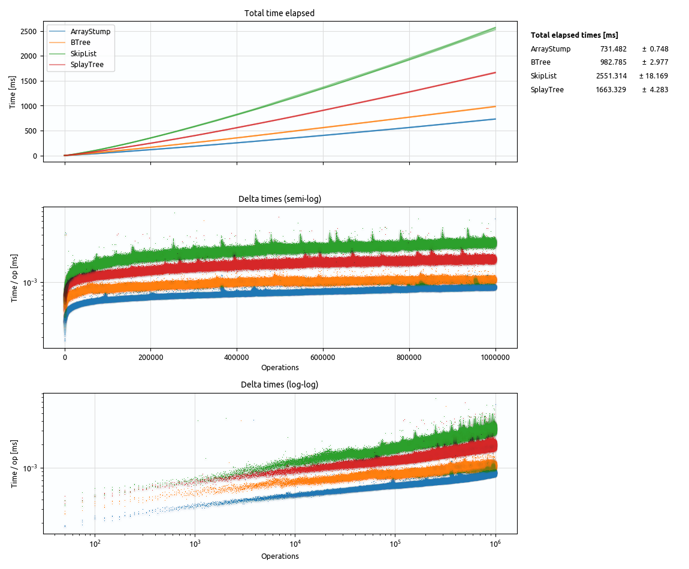
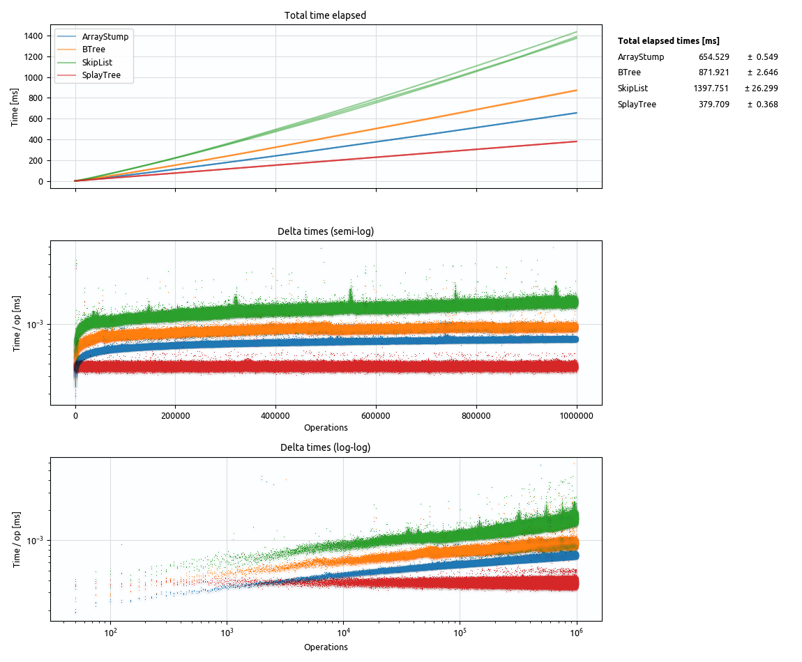

# rust-array-stump

A data structure mixing dynamic array and sorted set semantics.

- insert / remove: O(sqrt N)
- rank index / next / prev: O(1)

This data structure is similar to [hashed array trees](https://en.wikipedia.org/wiki/Hashed_array_tree), but optimized for insert/remove in the middle instead of minimizing wasted space.

TODO...

## Benchmarks

TODO...

Other implementations:

- [SkipList](https://docs.rs/skiplist/0.3.0/skiplist/)

### Insert (random)

### Insert (ascending)

### Insert (descending)

### Remove (random)

### Find (random)

### Find (recent)

