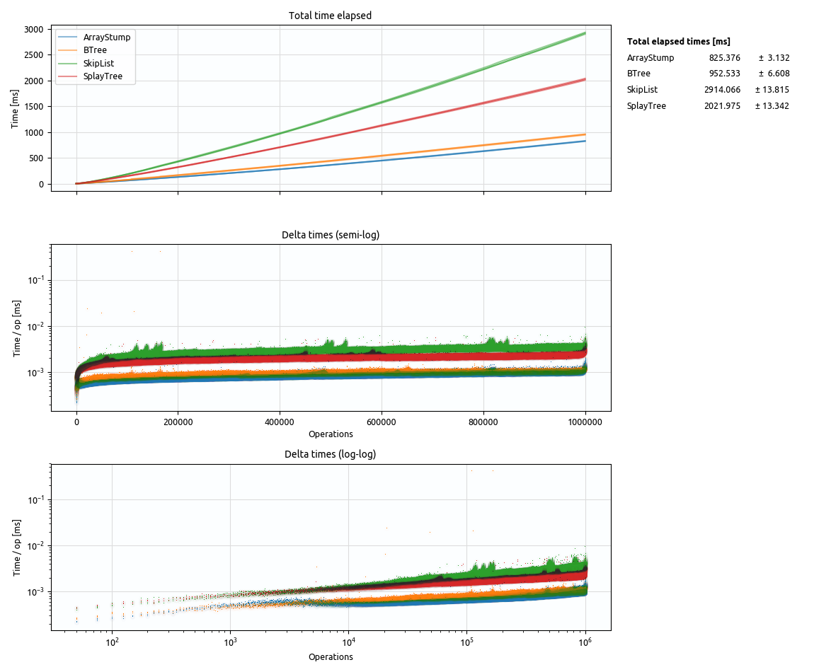

# rust-array-stump

A data structure mixing dynamic array and sorted set semantics.

- insert / remove: O(sqrt N)
- rank index / next / prev: O(1)

### Algorithm in 10 seconds

Algorithmic notes:
- In general, the data structure is similar to [hashed array trees](https://en.wikipedia.org/wiki/Hashed_array_tree), but optimized for insert/remove in the middle instead of inserting/removing at the end.
- In a sense, the structure resembles a two-level tree: The outer level ("root") is a dynamic array containing nested dynamic arrays ("leaves"). Hence array stump.
- The `max_leaf_capacity` gets doubled if the size of the top level array exceeds an upper threshold `alpha_1 * max_leaf_capacity`.
- The `max_leaf_capacity` gets halved if the average leaf fill ratio exceeds a lower threshold `alpha_2`.

## Use cases

rust-array-stump has been developed as potential core data structure for the sweep line algorithm in [rust-geo-booleanop](https://github.com/21re/rust-geo-booleanop). It may be applicable in other cases with similar properties:

- Moderate number of elements -- up to 1 million seems a reasonable range according to the benchmarks.
- Costly comparison function. Note that the complexity of insert/remove is O(sqrt N) with respect to the number of elements that have to be moved when updating the dynamic arrays. On the other hand, the number of comparison calls is only O(log N) due to employing binary search on each level. The benchmarks indicate that the number of comparison calls by rust-array-stump is often much lower compared to binary trees (probably because they may diverge from being balanced). In scenarios with a costly comparison function the algorithm can tolerate a farily large N until the O(sqrt N) effect of the relatively fast array insert become significant.
- Need for ranked access or frequent search for next/previous elements. In the sweep line algorithm for instance, every insert/remove is followed by a neighborhood check. With a tree, this comes down to several O(log N) calls per iteration, whereas with rust-array-stump it is an O(sqrt N) plus several O(1) calls.

Some design choices currently optimize for use in rust-geo-booleanop, but they may be lifted if need be:

- Custom compare function instead of using `Ordering` trait: The reason is the rust-geo-booleanop needs to sort sweep events differently in different context (simplified: horizontally for the time domain, vertically for the sweep line domain).
- Requires `T: Clone`: Using certain `Vec` operations that require `Clone` seems to have performance benefits.

## Benchmarks

Benchmarks... As always take with a grain of salt. A few general notes:

- The benchmarks use `T = f64` as underlying set type.

- In order to simulate the use case in rust-geo-booleanop of having a very complex comparison function, the float comparison has been artificially slowed down by (1) preventing inlining, and (2) two unnecessary `f64.exp()` calls. This imposes a penalty in particular for `std::collections::BTreeSet` which states in the docs:

    > Currently, our implementation simply performs naive linear search. This provides excellent performance on small nodes of elements which are cheap to compare.

    This can be reproduced in the benchmarks: When switching to a cheap comparison function, BTreeSet is by far the fastest implementation.

- In general the benchmarks measure the time of micro batches. For instance, in the 'insert' benchmark, the data structures get filled with N = 1 million elements, and the elapsed time is measured every k = 25 elements.

- Several of these runs are performed for statistical stability. This shows as a "bundle" of lines in the plots. As can be seen, results between runs are quite consistent and typically 3 runs were sufficient.

- Benchmark system specs: Intel(R) Core(TM) i5-4670 CPU @ 3.40GHz, 8 GB RAM, Ubuntu 18.04

Comparison data structures:

- [std::collections::BTreeSet](https://doc.rust-lang.org/std/collections/struct.BTreeSet.html)
- [SplayTree](https://github.com/21re/rust-geo-booleanop/tree/master/lib/src/splay): The implementation currently used in [rust-geo-booleanop](https://github.com/21re/rust-geo-booleanop), adapted from [alexcrichton/splay-rs](https://github.com/alexcrichton/splay-rs)
- [SkipList](https://docs.rs/skiplist/0.3.0/skiplist/)

### Insert (random)

Description

 

- This benchmark inserts N = 1 000 000 randomly drawn float elements in batches of k = 25 elements.
Elapsed time is evaluated after each batch.

### Insert (ascending)

Description

 

- Same as above, but using ascending floating point numbers.
- With default settings, the SplayTree crashes with a stack overflow, and requires to manually raise the stack size to make it work.

Plots

### Insert (descending)

Description

 

- Same as above, but using descending floating point numbers.
- With default settings, the SplayTree crashes with a stack overflow, and requires to manually raise the stack size to make it work.

Plots

### Remove (random)

Description

 

- This benchmark first fills N = 1 000 000 randomly drawn float elements into the containers without time measurement.
It then removes random (predetermined) elements in batches of k = 25.
Elapsed time is evaluated after each batch.
- The elapsed times have been reverted for the purpose of the plot so that the x-axis corresponds to the collection size, allowing for double-log plotting.

### Find (random)

Description

 

- This benchmark fills N = 1 000 000 randomly drawn float elements in batches of k = 25.
The insertion of the batch is not included in time measurement.
After inserting each batch, it calls find (`set.contains`) on k = 25 random elements that are known to exist in the set (elements to be found are predetermined and uniformly distributed).
Elapsed time only measures the time of finding the k = 25 elements.

### Find (recent)

Description

 

- This benchmark fills N = 1 000 000 randomly drawn float elements in batches of k = 25.
The insertion of the batch is not included in time measurement.
After inserting each batch, it calls find (`set.contains`) on the elements k = 25 elements that have just been inserted into the set (find order is randomized, i.e., the k = 25 insert values get shuffeled before the find).
Elapsed time only measures the time of finding the elements of a batch.
- This benchmark was intended to highlight the benefit of splay trees -- finding recently added values. It indeed shows very good performance in this case.

Plots

